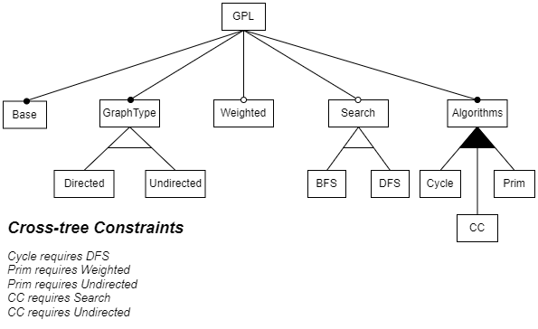

# Visualizing Analysis Results for Software Product Line Models - A User Study
 
This repository includes the supporting material for the paper "Visualizing Analysis Results for Software Product Line Models - A User Study."

## File description

The sections below explain the folders and files included in this repository.

### graphProductLine

This folder includes the C++ code implementing the Graph Product Line [1,2] and the models extracted from that implementation using the fact extractor Rex&uarr; [3]. 

The subfolder `code` includes the classes (`GraphApp`, `Node`, `Edge`) that compose the SPL and include conditional statements over the feature variables. The feature model for the system is shown below.

The subfolder `model` includes the files `nodes.cypher` and `edges.cypher`. Each file contain queries used to create a factbase of the system in a [Neo4j database](neo4j.com). Queries in `nodes.cypher` create nodes representing code entities (e.g., variable, functions) and `edges.cypher` include queries to create the relationships between such entities (e.g., function calls, variable writes). The following steps describe the process to create the models adopted in our user study:
  1. Create a Neo4j database instance (you can [this tutorial](https://neo4j.com/docs/aura/auradb/getting-started/create-database/))
  2. Run queries in `nodes.cypher`
  3. Run queries in `edges.cypher`

#### References
  1. Lopez-Herrejon, Roberto E., and Alexander Egyed. "Towards fixing inconsistencies in models with variability." Proceedings of the Sixth International Workshop on Variability Modeling of Software-Intensive Systems. 2012.
  2. Lopez-Herrejon, Roberto E., and Don Batory. "A standard problem for evaluating product-line methodologies." International Symposium on Generative and Component-Based Software Engineering. Springer, Berlin, Heidelberg, 2001. 
  3. R. Shahin, R. Toledo, R. Hackman, J. M. Atlee, and M. Chechik, “Applying Declarative Analysis to Industrial Automotive Software Product Line Models,” Empirical Software Engineering, vol. 28, no. 2, p. 40, 2023.

### studyInterfaces
The files in this folder show the interfaces the participants interacted with during the study.

  * *ScreeningQuestionnaire.pdf*: Screenshots of the webpage used to introduce the theme of the study and test candidates. Students whi correctly answered at leat 6 of the 7 questions were invited to participate in the study.
  * *stage1_(controlGroup|treatmentGroup).pdf*: Screenshots of the ^(Neo4j) Browser version used for the first stage of the study. Control participants did not have access the edge highlight feature.
  * *stage2_(controlGroup|treatmentGroup).pdf*: Screenshots of the webpage used during the second stage of the study. Participants in the treatment group were allocated in different subgroups that accessed different versions of this questionnaire, each version would have an distinct sequence of visualization options.

### rawData
This folder includes the data recorded during the study and used in statistical tests. Files used for quantitative analysis follow the name convention *scenario_variable.csv*, in which *scenario* describes the task category (identify, compare2, or compare3), the study stage (stage1 or stage 2), or the treatment type (visualizationOption) being tested, and *variable* describes the dependent variable (correctness, efficiency, or mental effort) being recorded. The folder also includes two spreadsheets containing participants demographics information (`demographics.xlsx`) and participants' response to the experience statements and open-ended feedback questions (`participantsFeedback.xlsx`). 

### statisticalTestResults
The results of the statistical tests using the files from folder `rawData`. Files in this folder follow a similar name convention with the addition of suffixes *_tTest* and *_OneWay Anova* to describe the performed tests.
